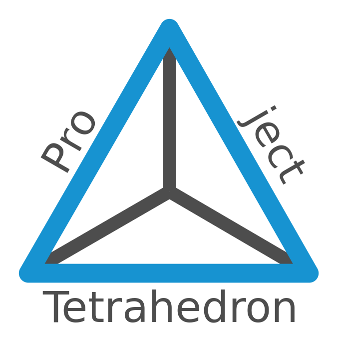

# Project Tetrahedron
*"Pushes boundaries of the computer hardware"*

## What is Project Tetrahedron?
Project Tetraedron is a desktop pc assembly and software project. Project started with three goals:
Computer should be...
- almost compleatly silent
- fully virtualised
- remote controllable

## Why git repository?
This git repository is meant for documentation about Project Tetrahedron. Git includes all the documentation necessary to build a physical computer and quides to help you configure software properly.

## Who is this for?
This git is meant for advanced users that are interested about these categories:
- Pc-building
- Passive cooling
- Linux
- Virtualisation technologies
-- QEMU
-- KVM
- Remote desktop

Guide is meant to be modular so if you are not interested about all the topics you shoul be able to easily read only parts you are interested in.

This guide is not meant for beginners unfortunately for now.

## About guide construction
Documents about computer construction and software guides are mainly inside [wiki](https://github.com/softgitron/Project-Tetrahedron/wiki). Project folder itself consist of example configuration files organized by two different logic.

1. Inside main directory everything is organized by normal linux folder structure. You should find all the relevant configuration files from same folder as in your local folder structure.
2. Inside Softwares directory you find all configuration files organized by software name.

## How to commit
If you have any ideas how to make guide more straight forward, want to add topic to expand guide, add your own example configuration files or just correct my typos (: you are free to make a pull request. I Will process all the pull request as quickly as I can.

# License
This project is licensed under nolicense - see the LICENSE for details

# Status
**Site is currently under hevy construction so there will be a lot of missing stuf!**
